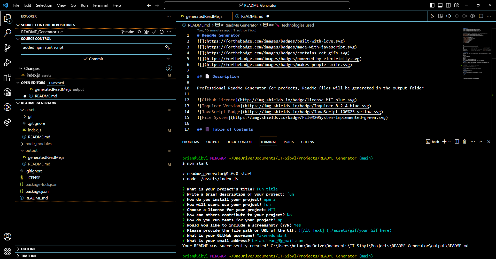

# ReadMe Generator


## 📄 Description

Professional ReadMe Generator for projects, ReadMe files will be generated in the output folder


## 📓 Table of Contents
- [ReadMe Generator](#readme-generator)
  - [📄 Description](#-description)
  - [📓 Table of Contents](#-table-of-contents)
  - [🪛 Technologies used](#-technologies-used)
  - [🖥️Installation](#️installation)
  - [💬Usage](#usage)
  - [🖼️Screenshot](#️screenshot)
  - [📹Video](#video)
  - [⚖️License](#️license)
  - [🤝Contributing](#contributing)
  - [🛠️Tests](#️tests)
  - [❔Questions](#questions)

## 🪛 Technologies used 

| Technology                   | Description                                 | Link                                                   |
|------------------------------|---------------------------------------------|--------------------------------------------------------|
| Node.js                      | Server-side JavaScript runtime               | [Node.js](https://nodejs.org/)                          |
| NPM                          | Node.js Package Manager                     | [NPM](https://www.npmjs.com/)                          |
| File System                  | Node.js module for file system operations   | [File System](https://nodejs.org/api/fs.html)           |
| Inquirer                     | Interactive command-line interface          | [Inquirer](https://www.npmjs.com/package/inquirer)     |


## 🖥️Installation

The user will require Node.js , File system and the inquirer module afterwhich users can clone the repository from Github
First run 
```pip
 npm install 
```
To install the dependencies

Second run
```pip
 npm start
```
This will run the index.js file in the assets folder  

Answer the inquirer prompts and the generated README will be in the output folder.

## 💬Usage

Users can use the terminal to answer questions about their project with Inquirer. The responses will
be saved and a ReadMe file will be generated.

## 🖼️Screenshot

Screenshot of terminal 



## 📹Video

Gif showcasing ```npm start``` and answering inquirer questions


https://drive.google.com/file/d/1PTYx6p0bFTAyru4TRihbT58r7dJeyoeo/view

## ⚖️License 

This project is licensed under MIT

## 🤝Contributing 

Users can contribute suggestions and other helpful additions to the project

## 🛠️Tests
To run testing use the command:
```pip
npm test
```
npm test using the Jest Testing Framework

## ❔Questions

If you have any questions about this project, please contact me directly at brian.trang9@gmail.com. Feel free to view more of my projects at https://github.com/MakeRedundant.
